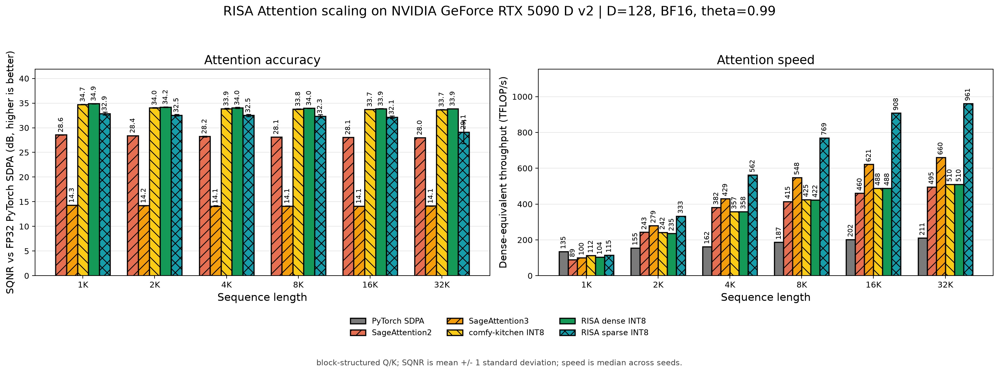
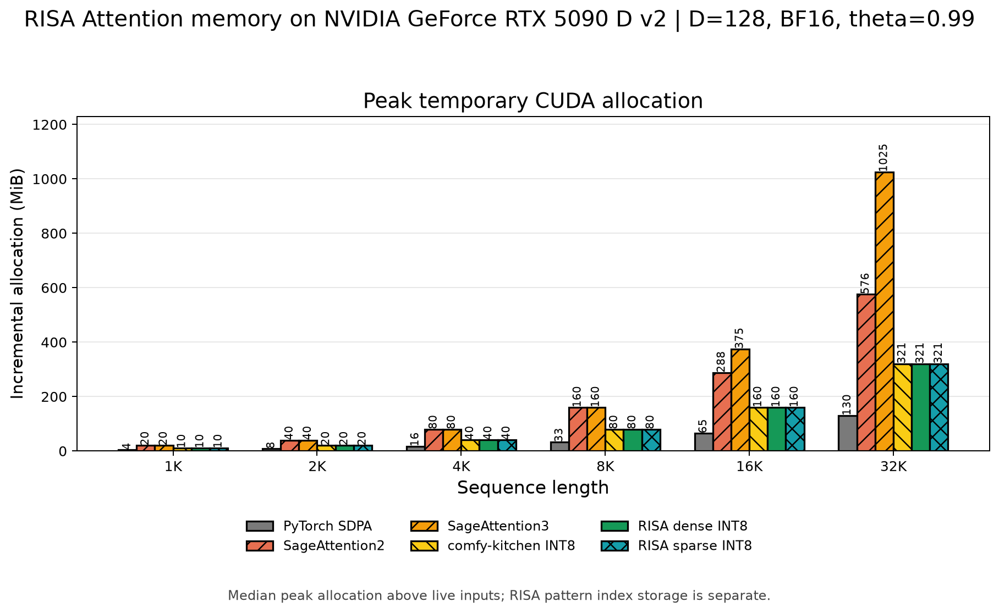
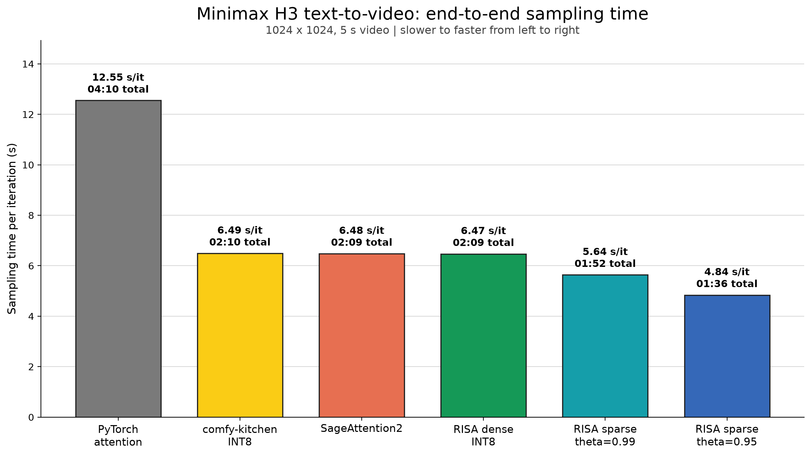

# RISA Attention

RISA (Rotation-stabilized INT8 Sparse Attention) is a CUDA extension for
diffusion inference. It provides a dense INT8 scaled-dot-product attention
path and an optional retained-mass block-sparse path for self-attention.

The dense kernel uses a shared Q/K orthogonal transform, a softmax-invariant
key translation, and residual-zero midpoint-affine INT8 V quantization. The
sparse path builds a block support while producing a dense result, then applies
that frozen support to later calls with current Q, K and V tensors. It is not a
KV cache and does not reuse an earlier attention output.

The package includes a PyTorch API, CUDA sources, reproducible benchmarks, and
a standalone ComfyUI custom node.

## Requirements

| Component | Requirement |
| --- | --- |
| Operating system | Linux |
| Python | 3.10 or newer |
| PyTorch | CUDA build, 2.4 or newer |
| CUDA Toolkit | 13.0 or newer |
| GPU | NVIDIA SM75 or newer |
| Build tools | CMake 3.26 or newer and Ninja |

Source builds produce native cubins for the selected CUDA architecture. Build
on the target GPU, or set `CMAKE_CUDA_ARCHITECTURES` while building a wheel.

## Installation

Install from a source checkout:

```bash
python -m pip install .
```

For an RTX 5090 build with cubins only:

```bash
CUDACXX=/usr/local/cuda/bin/nvcc \
CMAKE_ARGS="-DCMAKE_CUDA_ARCHITECTURES=120-real" \
python -m pip install .
```

Verify that the extension is available:

```bash
python -c "import risa_attention as risa; print(risa.int8_attention_is_available())"
```

## Quick Start

RISA uses `[batch, heads, sequence, head_dim]` (HND) tensors. Dense attention
accepts grouped-query attention: the number of query heads must be divisible by
the number of KV heads.

```python
import torch
import risa_attention as risa

q = torch.randn(1, 16, 4096, 128, device="cuda", dtype=torch.bfloat16)
k = torch.randn(1, 4, 4096, 128, device="cuda", dtype=torch.bfloat16)
v = torch.randn_like(k)

output = risa.int8_attention(q, k, v)
```

Prequantization separates packing from execution when the caller controls
temporary tensor lifetimes:

```python
packed = risa.prequantize_int8_attention(q, k, v)
output = risa.int8_attention_from_prequantized(packed)
```

To construct and reuse retained-mass support:

```python
dense_output, pattern = risa.construct_sparse_int8_attention(
    q, k, v, theta=0.99
)
later_output = risa.sparse_int8_attention(q, k, v, pattern)

print(pattern.coverage, pattern.measured_retained_mass, pattern.index_bytes)
```

The first call is dense construction. Reuse only a pattern from a compatible
shape, head layout, device, dtype and attention scale; refresh it when the
attention structure has changed.

## Capability and Limits

| Path | Q/K/V dtype | Attention form | Constraints |
| --- | --- | --- | --- |
| Dense INT8 | FP16, BF16, FP32 | Self- or cross-attention; GQA/MQA; unequal Q/K lengths | HND layout; head dimension 1-256 |
| Dense INT8 with mask | FP16, BF16, FP32 | Same as dense | Mask must broadcast to `[B, Hq, Lq, Lkv]` |
| Retained-mass sparse | FP16, BF16, FP32 | Unmasked self-attention; GQA/MQA | `Lq == Lkv`; support must be constructed before reuse |

Sparse support is an approximation controlled by `theta`. Higher values retain
more attention mass and typically reduce sparsity; `0.99` is the ComfyUI node
default. Short sequences or near-uniform attention may not amortize the
construction cost. Evaluate with model trajectories before using sparse mode in
a production image or video workflow.

## ComfyUI

Install RISA with ComfyUI's Python interpreter, then link the bundled node:

```bash
cd /path/to/RisaAttention
CUDACXX=/usr/local/cuda/bin/nvcc \
CMAKE_ARGS="-DCMAKE_CUDA_ARCHITECTURES=120-real" \
/path/to/comfyui/python -m pip install .

ln -s /path/to/RisaAttention/comfyui-risa-attention \
  /path/to/ComfyUI/custom_nodes/comfyui-risa-attention
```

Restart ComfyUI and add **RISA Attention** before the sampler.

| Node mode | Behavior |
| --- | --- |
| `pytorch_attention` | ComfyUI's PyTorch attention backend |
| `int8_attention` | Dense RISA INT8 attention |
| `sparse_int8_attention` | Dense construction, then sampling-scoped sparse reuse |

The node keys patterns by sampling run, conditioning branch and attention-call
ordinal. Masks, cross-attention, compiled execution and incompatible sparse
shapes remain on dense INT8. See [ComfyUI integration](docs/comfyui.md) for
lifecycle details.

## Measured Results

The tables below are controlled attention-kernel measurements, not image or
video quality results. Reproduction commands, metric definitions, raw JSON
schema and additional baselines are in [bench/README.md](bench/README.md).

### Dense GQA

NVIDIA GeForce RTX 5090 D v2, PyTorch 2.13.0, CUDA 13.0, BF16,
`B=1, Hq=16, Hkv=4, D=128`, 30 warmups and 200 CUDA-event samples. Values are
median end-to-end latency; RISA and comfy-kitchen columns show
`latency / NRMSE` against PyTorch SDPA for the same BF16 inputs.

| Length | PyTorch SDPA | RISA dense INT8 | comfy-kitchen INT8 | RISA / SDPA |
| ---: | ---: | ---: | ---: | ---: |
| 1K | 0.062 ms | 0.074 ms / 0.0142 | 0.070 ms / 0.0152 | 0.83x |
| 2K | 0.219 ms | 0.133 ms / 0.0148 | 0.129 ms / 0.0158 | 1.65x |
| 4K | 0.838 ms | 0.352 ms / 0.0153 | 0.349 ms / 0.0164 | 2.38x |
| 8K | 2.925 ms | 1.229 ms / 0.0158 | 1.169 ms / 0.0169 | 2.38x |
| 16K | 10.838 ms | 4.358 ms / 0.0157 | 4.357 ms / 0.0168 | 2.49x |
| 32K | 41.545 ms | 16.893 ms / 0.0156 | 16.896 ms / 0.0168 | 2.46x |

### Sparse Reuse

The following uses the same GQA shape with `video_blocks`, `theta=0.99` and
Q/K drift `0.05`. Construction produces a dense output and a sparse pattern;
its cost is deliberately separate from steady-state sparse calls.

| Length | Construction | Dense INT8 | Sparse INT8 | Coverage | Dense / sparse |
| ---: | ---: | ---: | ---: | ---: | ---: |
| 1K | 0.134 ms | 0.074 ms | 0.075 ms | 56.9% | 0.99x |
| 2K | 0.192 ms | 0.134 ms | 0.099 ms | 50.0% | 1.35x |
| 4K | 0.451 ms | 0.351 ms | 0.213 ms | 52.8% | 1.65x |
| 8K | 1.401 ms | 1.229 ms | 0.622 ms | 50.0% | 1.98x |
| 16K | 4.892 ms | 4.356 ms | 2.506 ms | 54.6% | 1.74x |
| 32K | 18.762 ms | 16.898 ms | 8.664 ms | 50.6% | 1.95x |

For this synthetic workload, construction repays after two compatible reuses
at 2K and after one reuse from 4K through 32K. At 1K, dense attention is the
practical choice.

### Attention Kernel Scaling

The kernel scaling comparison uses non-causal BF16 MHA
(`B=1, Hq=Hkv=16, D=128`) because the current SageAttention3 Blackwell API has
no GQA/MQA kernel. It uses `video_blocks`, `theta=0.99`, drift `0.05`, seeds
0-2, 30 warmups and 200 timed calls; SQNR is measured against FP32 PyTorch
SDPA. SageAttention calls include a K clone because their public APIs modify K
during smoothing. The full protocol is in [bench/README.md](bench/README.md).





At 32K, RISA sparse measured `9.149 ms`, `29.13 +/- 2.34 dB` SQNR and
`320.6 MiB` peak incremental allocation. Under this MHA protocol,
SageAttention2 measured `17.760 ms`, `27.99 +/- 0.03 dB` and `576.1 MiB`;
SageAttention3 measured `13.321 ms`, `14.14 +/- 0.01 dB` and `1025.0 MiB`.
These measurements do not predict end-to-end generation quality.

For the V quantization ablation, see
[MIDPOINT_V_BENCHMARK.md](bench/MIDPOINT_V_BENCHMARK.md).

### Minimax H3 End-to-End Sampling

The following single-run Minimax H3 text-to-video snapshot uses a 1024 x 1024
prompt and produces a 5 s video. It measures full sampling time rather than an
isolated attention call; the values therefore include the rest of the model and
runtime. RISA sparse at `theta=0.95` completed in `01:36` (`4.84 s/it`), a
`2.59x` reduction in per-iteration time from PyTorch attention's `12.55 s/it`.

| Attention backend | End-to-end sampling time | Time per iteration |
| --- | ---: | ---: |
| PyTorch attention | 04:10 | 12.55 s/it |
| comfy-kitchen INT8 | 02:10 | 6.49 s/it |
| SageAttention2 | 02:09 | 6.48 s/it |
| RISA dense INT8 | 02:09 | 6.47 s/it |
| RISA sparse, `theta=0.99` | 01:52 | 5.64 s/it |
| RISA sparse, `theta=0.95` | 01:36 | 4.84 s/it |



## API

| Entry point | Purpose |
| --- | --- |
| `int8_attention` | Fused dense INT8 attention |
| `prequantize_int8_attention` | Pack Q/K/V without executing attention |
| `int8_attention_from_prequantized` | Execute dense attention from packed tensors |
| `construct_sparse_int8_attention` | Return a dense output and retained-mass pattern |
| `sparse_int8_attention` | Execute attention with a frozen sparse pattern |
| `build_retained_mass_pattern` | FP32 reference pattern builder |
| `measure_pattern_recall` | Measure retained mass on supplied Q/K tensors |

Public entry points are exported from `risa_attention`; `risa_attention._C` is
private.

## Tests and Benchmarks

Run the test suite:

```bash
python -m pytest -q -p no:cacheprovider
```

Benchmark usage and measurement conventions are documented in
[bench/README.md](bench/README.md).

```bash
python bench/benchmark_attention.py --help
python bench/benchmark_midpoint_v.py --help
python bench/benchmark_sparse.py --help
```

## Repository Layout

```text
RisaAttention/
|-- src/risa_attention/          Python API
|-- csrc/kernels/                CUDA kernels
|-- comfyui-risa-attention/      ComfyUI node
|-- bench/                       Reproducible benchmarks
|-- tests/                       CUDA and adapter tests
|-- BLOG.md                      Chinese design article
|-- docs/design.md               Algorithms and implementation notes
`-- docs/comfyui.md              ComfyUI lifecycle and compatibility
```

## Documentation

- [Design and numerical methods](docs/design.md)
- [RISA Attention design article (Chinese)](BLOG.md)
- [ComfyUI integration](docs/comfyui.md)
- [Benchmark guide](bench/README.md)
- [Retained-mass selector benchmark](bench/RETAINED_MASS_SELECTOR_BENCHMARK.md)
- [Contributing](CONTRIBUTING.md)

## License and Attribution

RISA Attention is available under the [Apache License 2.0](LICENSE).

The dense kernel builds on techniques and CUDA implementations from
SageAttention and comfy-kitchen. Sparse support selection is informed by LoSA,
and parts of the kernel infrastructure derive from FlashInfer. Derived source
files retain their upstream copyright and license notices; implementation
details and differences are documented in [docs/design.md](docs/design.md).
